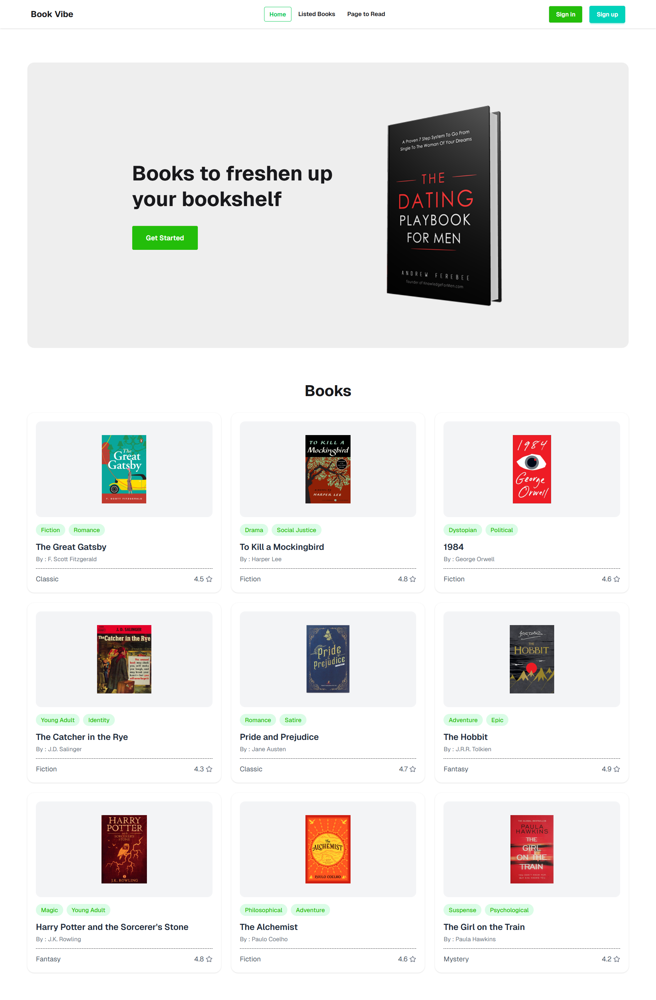
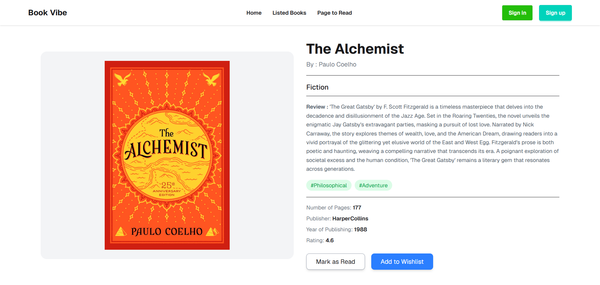
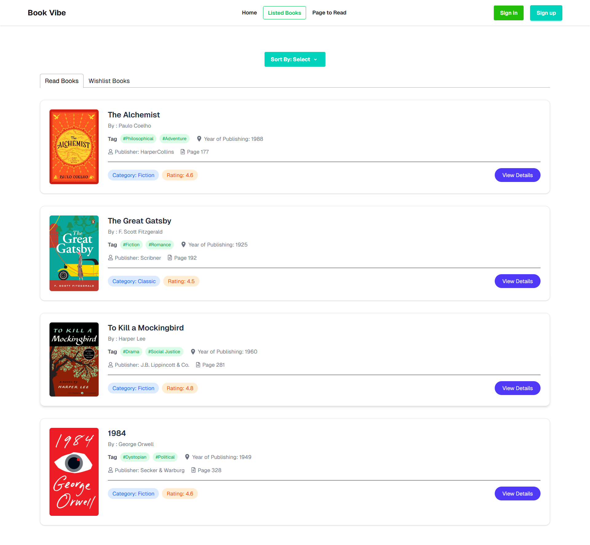
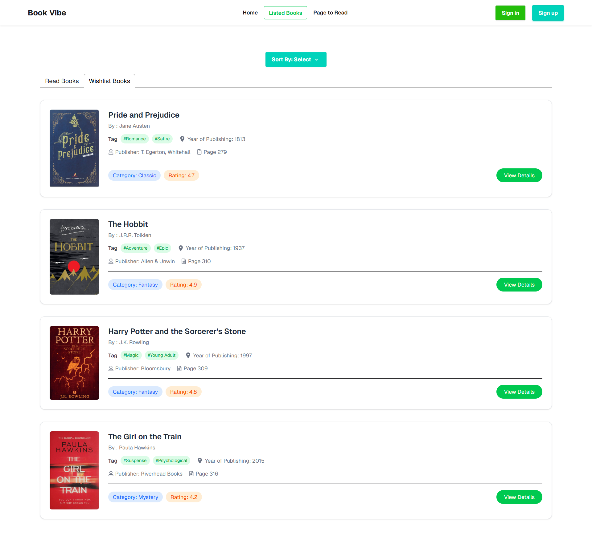
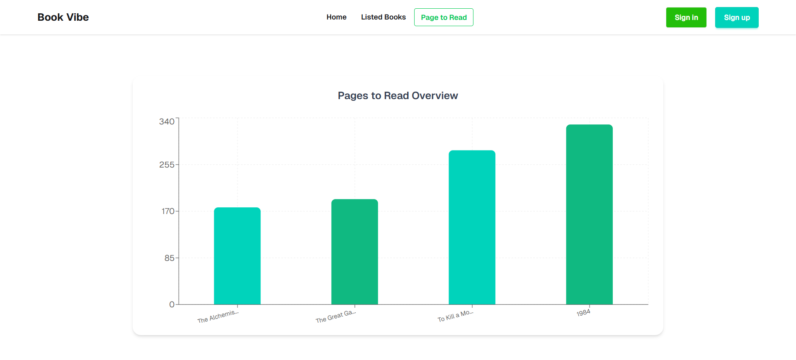

<div align="center">

# 📚 Book Vibe

### *Your personal book management dashboard*

A modern React-based platform to organize your reading journey, track progress, and visualize your reading habits with interactive data insights.


<br/>

[](https://reactjs.org/)
[](https://reactrouter.com/)
[](https://tailwindcss.com/)
[](https://recharts.org/)
[](https://fkhadra.github.io/react-toastify/introduction)

</div>

---

## 🚀 Overview

**Book Vibe** is a feature-rich book management dashboard designed to help users organize their reading life efficiently. It allows users to categorize books into **Read** and **Wishlist**, track progress, and gain insights through interactive visual analytics.

The project focuses on mastering **React Router for multi-page navigation** and **Context API for global state management**, ensuring a smooth and scalable application structure.

---

## 🌐 Live Demo

👉 **[View Live Project](https://book-vibe-react-project-ph.netlify.app/)**

---

## 📸 Product Showcase

### 🏠 Home Interface



A clean and curated book gallery with structured categories, modern typography, and smooth browsing experience.

---

### 📖 Book Details



Detailed book view including ratings, reviews, publisher info, and quick actions like **Mark as Read** and **Add to Wishlist**.

---

## 📚 Library Management

<details>
<summary><strong>✅ Read Books Tracker</strong></summary>
<br/>



> A dedicated section to track completed books with sorting options by rating and page count.
</details>

---

<details>
<summary><strong>⭐ Wishlist Management</strong></summary>
<br/>



> Save books for later reading with instant UI updates when moving items between lists.
</details>

---

## 📊 Data Visualization



An interactive **Recharts bar chart** that visualizes total pages of books in the "Read" list, giving a clear overview of reading progress.

---

## ✨ Key Features

- 🔄 Dual list system (Read & Wishlist)
- 📊 Interactive reading progress visualization
- 🔍 Smart sorting by rating and page count
- 🌐 Multi-page routing with React Router
- ⚡ Context API for global state management
- 📱 Fully responsive UI across devices
- 💡 Smart empty-state handling for better UX

---

## 🛠 Tech Stack

| Technology | Purpose |
|------------|---------|
| React.js | UI Development |
| React Router DOM | Navigation System |
| Context API | State Management |
| Recharts | Data Visualization |
| React Toastify | Notifications & Alerts |
| Tailwind CSS | Styling |
| DaisyUI | UI Components |

---

## 💡 What I Learned

- Managing global state efficiently using Context API  
- Building multi-page applications with React Router  
- Transforming data into meaningful visual charts using Recharts  
- Improving UX with empty states and dynamic UI feedback  
- Structuring scalable React project architecture  

---

## 🚀 Getting Started

### Clone Repository

```bash
git clone https://github.com/abutalha08/book-vibe.git
cd book-vibe
npm install
npm run dev
```

---

## 📱 Responsive Design

Book Vibe is fully responsive and optimized for mobile, tablet, and desktop devices, ensuring a seamless reading experience across all screen sizes.

---

## 💙 Author

<div align="center">

Made with 💙 by [Abu Talha Taufique](https://github.com/abutalha08)

*Book Vibe — organize your reading journey, visualize your progress, and discover your next great book.*

© 2026 Book Vibe. All rights reserved.

</div>